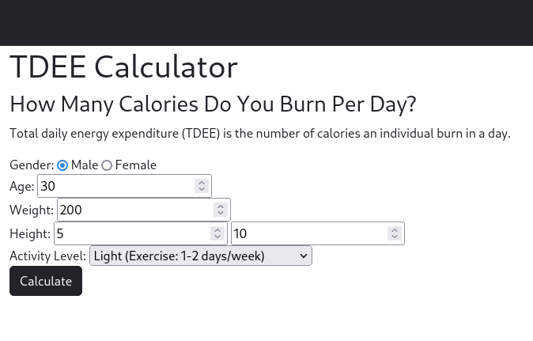

# Caloric Expenditure Website

## Description

My Total Daily Energy Expenditure website provides tools and calculators to estimate the number of calories a person burns in a day based on their activity level, age, gender, weight, and other factors. It helps individuals understand their daily energy needs, which is useful for weight management goals, such as losing, maintaining, or gaining weight. My website provides information on how to calculate TDEE, as well as information for tracking food intake and physical activity to achieve desired calorie goals.

This is a personal project meant to create a user interface for my TDEE calculator program that I built with C++.

## Features

- Idex
  

- FAQ
- About
- Contact
